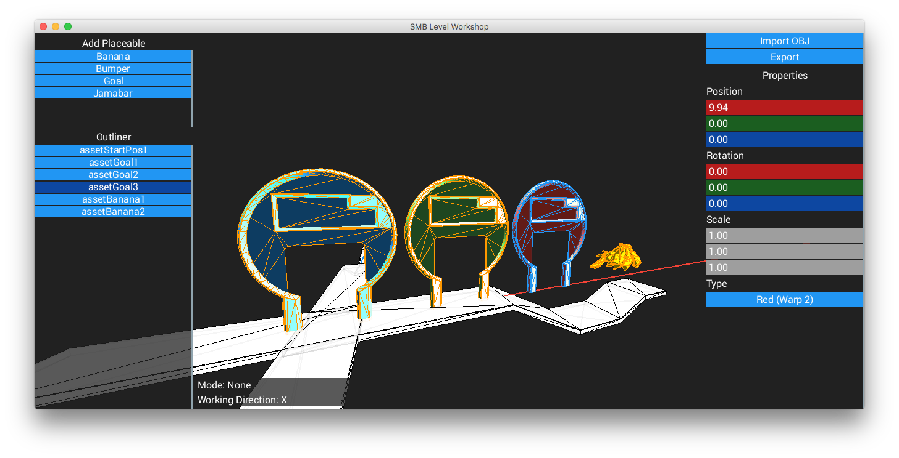
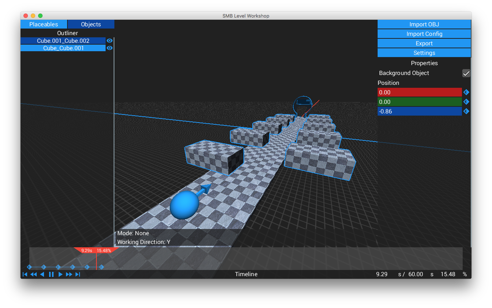

# SMBLevelWorkshop
A Super Monkey Ball Level Editor




### Building from Source
First, make sure you have JDK 8 or higher installed, Git, as well as Gradle (Or just use the bundled Gradle by using `./gradlew` on Unix like systems, or `gradlew.bat` on Windows)

##### Cloning this Repository
```shell
git clone https://github.com/CraftedCart/SMBLevelWorkshop.git
cd SMBLevelWorkshop
git submodule update --init --recursive
```
##### Creating a JAR file
```shell
gradle jar
```

##### Getting LWJGL natives
```shell
gradle natives
```

##### Copying natives over
###### Windows *(Note: I don't know Windows commands - Just do it in Explorer)*
Copy everything in `build\natives-windows` to `build\libs`

###### OS X / macOS
```shell
cp -r build/natives-osx/* build/libs
```

###### Linux
```shell
cp -r build/natives-linux/* build/libs
cp lib/libfixXInitThreads.so build/libs #Don't forget this!
```

##### Running SMB Level Workshop
```shell
cd build/libs
java -Djava.library.path=. -jar smblevelworkshop-1.0-SNAPSHOT.jar
```
